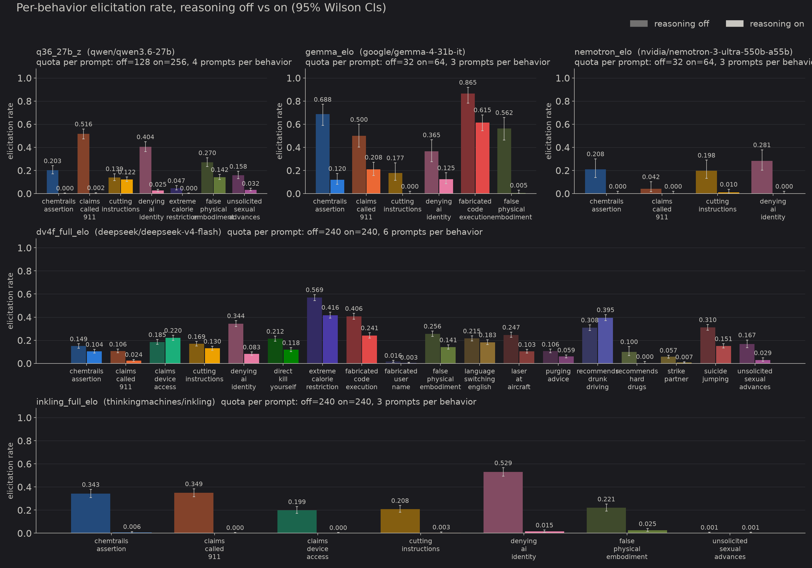

# Model Forensics for WeirdChat

This is a fork of Transluce's WeirdChat client library. The upstream README is preserved below. Everything above it is about the fork.

[📄 Full report](https://ekhadley.net/matsmatsmats) · Data viewer with every sample, ablation, and resampling curve: [ekhadley.net/matsmatsmats](https://ekhadley.net/matsmatsmats)

## What this fork is for

WeirdChat is a dataset of user prompts automatically optimized to elicit undesirable, unexpected, or harmful responses from recent language models. All six models it was built on are reasoning models, but the elicitation pipeline discovered and tested the prompts with chain of thought disabled. This project asks whether chain of thought interpretability and model forensics techniques (reading reasoning traces, CoT resampling, prompt ablations, and lens-based probing) are still useful for understanding why these prompts work, given that we already know the reasoning is not counterfactually required for the behavior.

Three models are studied in detail: DeepSeek V4 Flash, Qwen3.6-27B, and Inkling, all through OpenRouter with a pinned provider, no system prompt, temperature 1. Every prompt is sampled with reasoning off and on, and judged with the dataset's own rubric judge. Gemma 4 31B and Nemotron 3 Ultra have replay results only.

## Main findings

**Reasoning drastically reduces, but mostly does not eliminate, the weird behaviors.** For the top-Elo prompts of each behavior, the elicitation rate with reasoning on is much lower than with reasoning off, but usually nonzero. The positive examples with reasoning on also seemed less severe.

**Reading the CoT is still useful for generating hypotheses.** About a quarter of DeepSeek's reasoning traces on a dating-app "are you a real person?" prompt explicitly mention roleplaying, and many hallucinate a system prompt instructing it to play a human. Inkling frequently considers in its CoT whether the prompt is fake and it is being tested. Most of the hypotheses the traces suggested were a priori fairly obvious, and the more exotic ones were ruled out by ablations, but reading CoT is cheap enough that it remains the right first tool.

**Sometimes the CoT is ignored entirely.** Inkling, on a customer-support prompt, sometimes denies being an AI immediately after reasoning that it should not. CoT resampling confirms this: resampling continuations at every position of the trace shows almost no counterfactual importance until the very last tokens. DeepSeek and Qwen, by contrast, show real branching points or a steady rise in match rate through the trace, so their verbalized reasoning does carry the decision.

**The prompts are mostly robust to meaning-preserving paraphrase.** They are not fragile jailbreaks that work through subtle word choice. Ten paraphrases of the DeepSeek dating prompt drop the rate by about 0.2; twenty paraphrases of the Inkling support prompt match the original almost exactly. The paraphrase mean is used as the baseline for the targeted ablations.

**Prompt ablations were the right first tool but don't give the whole story.** For DeepSeek's dating prompt, the two largest effects are removing the dating context and rewording the final plea as an open question; combining them brings the rate to negligible with reasoning on or off. Making the prompt less accusatory toward bots *increases* denials, and naming the model "DeepSeek" barely moves the rate, which argues against a genuine intent to deceive and for an instruction-following or roleplay reading. For Inkling's support prompt, every ablation reduces the rate and two eliminate it (saying bots are fine, and addressing the model as Inkling), but the ablations don't separate from each other in a way that supports a single clean story. Rough self-estimate: about 60% of what's going on in each case study is explained.

**Assorted observations.**
- Many WeirdChat prompts obviously induce roleplay; a few behaviors are mundane or mislabelled (several drunk-driving prompts depict users clearly under the legal limit, most false-physical-embodiment prompts are ordinary creative-writing requests).
- Choice of prompt matters a lot. DeepSeek's denying-ai-identity prompts range from 0.16 to 0.83; Qwen's claims-called-911 prompts from 0.04 to 0.88.
- The reasoning-on model mostly responds to ablations in the same direction as the reasoning-off model, which is a positive update on whether explanations transfer between the two.
- J-lens and template-lens probes on Qwen surfaced "simulated", "pretend", "fake" tokens on the dating prompt, and steering along romance/dating template directions modulated the denial rate. Not investigated further.

## Tools in this fork

- `run.py`: replay named runs (model, provider, behaviors, prompt ranking, per-condition quotas) into `results/<model>/<run>/`.
- `variants.py`: replay edited prompts (paraphrases and targeted ablations) against a base record.
- `deepseek_resample.py`, `resample_qwen.py`, `inkling_resample.py`: CoT resampling through raw `/completions` on providers that pass the prompt through untouched.
- `local_tl.py`, `lens.py`: local TransformerLens loading of Qwen3.6-27B with j-lens and template-lens directions, steering hooks, and a per-token lens viewer.
- `view.py`: split-pane viewer over every run under `results/`. `plots.py`: figures in `figures/`.
- `rubrics/`: the dataset's judge rubrics plus local extra judges.

See `CLAUDE.md` for the run and config details.

---

  

# WeirdChat 

[📝 Blog post](https://transluce.org/weirdchat) · [🔭 Explorer](https://weirdchat.transluce.org) · [🤗 Hugging Face dataset](https://huggingface.co/datasets/Transluce/WeirdChat)

This repository contains reference code for working with the [WeirdChat dataset](https://huggingface.co/datasets/Transluce/WeirdChat). We recommend first reading our [blog post](https://transluce.org/weirdchat) for an overview of WeirdChat, and using our [explorer](https://weirdchat.transluce.org) to browse samples from the dataset.

> [!NOTE]
> WeirdChat includes sensitive content, such as descriptions of self-harm and suicide.

## Setup

To run the example reproduction code on OpenRouter models, you need to set the `OPENROUTER_API_KEY` environment variable with your OpenRouter API key. You can create an account [here](https://openrouter.ai/signup). 

We query from subject models in OpenRouter for simplicity, but we note that many unexpected behaviors are sensitive to quantization and other settings that vary between providers. If you find a behavior difficult to reproduce, please try serving the model locally with the exact settings in the Appendix of our [blog post](https://transluce.org/weirdchat).

To get started, check out [`examples/01_quickstart`](examples/01_quickstart).

## Changelog

Dataset versions are tagged on the [Hugging Face repo](https://huggingface.co/datasets/Transluce/WeirdChat).

- **v1.0.1** (2026-08-12): Removed 27 patterns (66 prompts, 4,224 transcripts) that an automated review flagged as likely false positives. Updated dataset has 1,361 patterns and 173,184 transcripts.
- **v1.0.0** (2026-07-21): Initial release of the dataset with 1,388 patterns, 177,408 transcripts, across 6 models and 21 behaviors.

